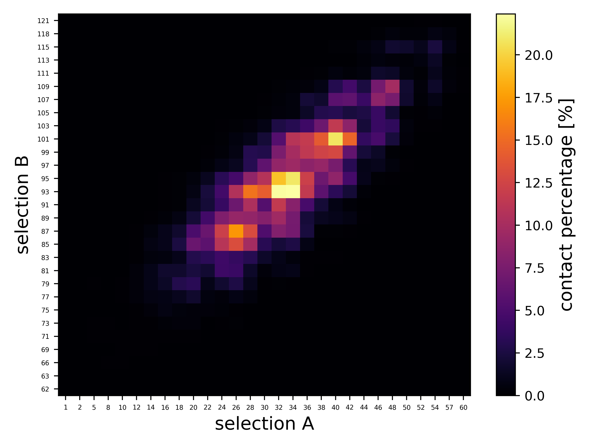

# contact: Contact Matrix Calculator

Calculates contact matrix for two selections of atoms. Contact will output 2D matrix of a relative number of trajectory frames during which every two atoms from the selections were 'in contact', i.e. closer than a specified cut-off value.

## Dependencies

`contact` requires you to have groan library installed. You can get groan from [here](https://github.com/Ladme/groan). See also the [installation instructions](https://github.com/Ladme/groan#installing) for groan.

## Installation

1) Run `make groan=PATH_TO_GROAN` to create a binary file `contact` that you can place wherever you want. `PATH_TO_GROAN` is a path to the directory containing groan library (containing `groan.h` and `libgroan.a`).
2) (Optional) Run `make install` to copy the the binary file `contact` into `${HOME}/.local/bin`.

## Options

```
Usage: contact -c GRO_FILE -a SELECTION1 -b SELECTION2 [OPTION]...

OPTIONS
-h               print this message and exit
-c STRING        gro file to read
-f STRING        xtc file to read (optional)
-n STRING        ndx file to read (optional, default: index.ndx)
-o STRING        output file name (default: contacts.dat)
-a STRING        selection of atoms
-b STRING        selection of atoms
-u FLOAT         cut-off for contact [nm] (default: 0.5)
```

Use [groan selection language](https://github.com/Ladme/groan#groan-selection-language) to specify atoms (using flags `-a` and `-b`) for which the contact matrix shall be calculated.

## Example usage

```
center -c md.gro -f md.xtc -a "resid 1 to 15 && name CA" -b "resid 16 to 30 && name CA" -u 0.2
```

This command will calculate contact matrix for two selections based on the trajectory `md.xtc` (every frame will be analyzed). Selection A will contain all atoms belonging to residues 1 to 15 and having the name CA (flag `-a`). Selection B will contain all atoms belonging to residues 16 to 30 and having the name CA (flag `-b`). Two atoms are to be considered to be in contact if they are closer to each other than 0.2 nm (flag `-u`). For each pair of atoms from selection A and selection B, the relative number of trajectory frames in which the two atoms have been in contact will be written out into `contacts.dat` (default option).

The output file has the following format:
```
# SPECIFICATION OF THE PROGRAM USED AND ITS VERSION
# ARGUMENTS OF THE COMMAND LINE
                      SELECTION_A_ATOM_1    SELECTION_A_ATOM2    SELECTION_A_ATOM3    ....
SELECTION_B_ATOM_1   	 CONTACT_A1-B1        CONTACT_A2-B1        CONTACT_A3-B1
SELECTION_B_ATOM_2       CONTACT_A1-B2        CONTACT_A2-B2        CONTACT_A3-B2
...
```

`CONTACT_A?-B?` specifies the relative number (<0,1>) of trajectory frames in which the two concerned atoms have been in contact. 

Plotted contact matrix can look for example like this:



## Limitations

Assumes that the simulation box is rectangular and that periodic boundary conditions are applied in all three dimensions.

Only tested on Linux. Probably will not work on anything that is not UNIX-like.
